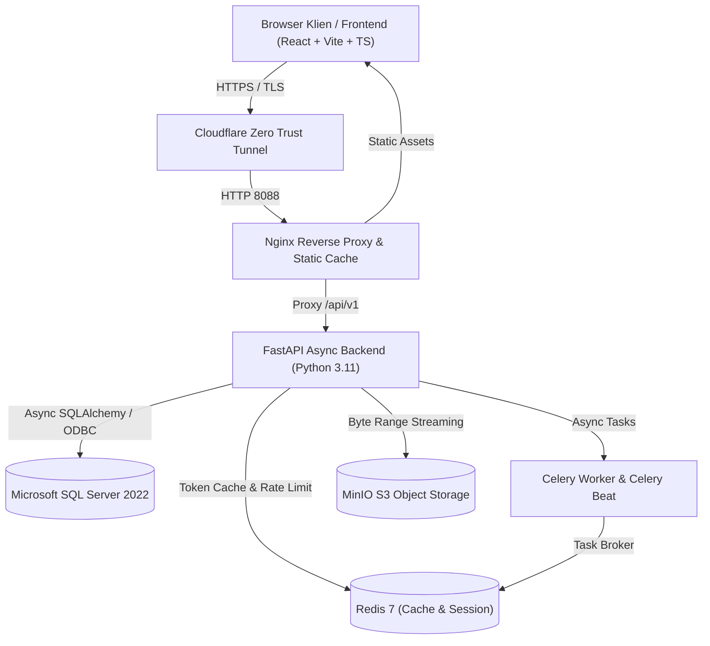

# ?? LMS Platform Enterprise

<div align="center">

[](https://fastapi.tiangolo.com)
[](https://reactjs.org)
[](https://www.typescriptlang.org)
[](https://tailwindcss.com)
[](https://www.microsoft.com/sql-server)
[](https://redis.io)
[](https://min.io)
[](https://www.docker.com)
[](https://developers.cloudflare.com/cloudflare-one/connections/connect-networks/)
[](LICENSE)

**Platform Pembelajaran Daring Skala Enterprise dengan Performa Tinggi, Keamanan Akses Modul Presisi, Evaluasi Kuis Aman, dan Streaming Video Responsif.**

[Fitur Utama](#-fitur-utama) � [Arsitektur Sistem](#-arsitektur-sistem) � [Struktur Proyek](#-struktur-proyek) � [Panduan Instalasi](#-panduan-instalasi--deployment) � [Kredensial Pengujian](#-akun-dan-token-pengujian) � [Dokumentasi API](#-ringkasan-rest-api)

</div>

---

## ?? Ikhtisar Proyek

**LMS Platform Enterprise** adalah solusi Learning Management System yang dirancang khusus untuk memenuhi standar keandalan tinggi industri teknologi dan telekomunikasi. Dibangun dengan pendekatan *modular asynchronous*, sistem ini mengintegrasikan otentikasi berbasis peran (*Role-Based Access Control*), mekanisme penguncian modul berbasis token presisi, evaluasi pemahaman materi server-side yang aman dari kebocoran jawaban, serta pemutaran video beresolusi tinggi dengan dukungan *HTTP 206 Partial Content Range Streaming*.

---

## ?? Fitur Utama

### 1. ?? Strict Module Access Token Binding
* Setiap modul pembelajaran diproteksi oleh token akses unik dengan masa kedaluwarsa dan kuota pemakaian dinamis.
* Sistem secara tegas memvalidasi keterikatan token dengan modul tujuan (`token.module_id == target_module_id`). Token modul lain ditolak di level API backend.

### 2. ??? Server-Side Quiz Engine (Anti-Leak Protection)
* Evaluasi kuis pilihan ganda diproses dan dinilai sepenuhnya di server backend.
* Respons evaluasi menyajikan persentase skor, status kelulusan, dan ringkasan jumlah benar/salah **tanpa membocorkan kunci jawaban atau opsi yang benar**, mencegah hafalan jawaban saat pengulangan kuis.

### 3. ?? Live Cumulative Progress Synchronization
* Status kelulusan dan kemajuan belajar dihitung secara matematis langsung dari basis data relasional MSSQL (`UserModuleProgress` & `SessionProgress`).
* Tampilan progres persentase, sesi yang telah selesai, dan status modul diperbarui secara real-time pada kartu modul peserta.

### 4. ?? High-Definition Media & HTTP 206 Partial Streaming
* Pipeline penanganan media gambar dengan kompresi visual berkualitas tinggi (LANCZOS).
* Dukungan penuh *HTTP 206 Partial Content Chunked Range Streaming* untuk video pembelajaran berukuran besar tanpa buffering berlebih.
* Dual backend storage: Local Storage berkecepatan tinggi dengan auto-mirroring ke MinIO S3 Object Storage.

### 5. ??? Comprehensive Admin & Instructor CMS
* **Manajemen Modul & Sesi:** Pembuatan modul bertingkat, penambahan materi teks, gambar diagram, video, dan bank soal kuis.
* **Token Generator:** Pembuatan token satuan maupun *bulk generator* dengan pengaturan kuota pemakaian.
* **Cohorts & Angkatan:** Pengelompokan peserta pelatihan berbasis grup angkatan.
* **Laporan & Analitik:** Perhitungan rasio kelulusan peserta per modul secara otomatis.

---

## ??? Arsitektur Sistem



---

## ??? Tech Stack

| Domain | Teknologi | Keterangan |
| :--- | :--- | :--- |
| **Backend API** | **FastAPI** (Python 3.11) | Framework asinkron berkecepatan tinggi dengan validasi Pydantic v2 |
| **Database** | **Microsoft SQL Server 2022** | RDBMS kelas enterprise dengan driver ODBC 18 & SQLAlchemy 2.0 async |
| **Frontend** | **React 18**, **TypeScript**, **Vite** | Single Page Application modern dengan Tailwind CSS & Radix UI |
| **Cache & Task Queue** | **Redis 7** & **Celery 5** | Manajemen sesi terdistribusi, rate limiting, dan pemrosesan background |
| **Object Storage** | **MinIO** (S3-Compatible) | Penyimpanan aset media gambar dan video demonstrasi terpusat |
| **Web Server & Proxy** | **Nginx** (Alpine) | Reverse proxy, static file server, dan dynamic DNS resolver |
| **Ingress & Networking** | **Cloudflare Tunnel** | Akses publik aman tanpa port forwarding langsung ke internet |
| **Containerization** | **Docker & Docker Compose** | Multi-container orchestration terisolasi dan reproducible |

---

## ?? Struktur Proyek

```text
lms/
+-- backend/                  # REST API Backend (FastAPI)
�   +-- app/
�   �   +-- api/v1/          # Route handlers & endpoints
�   �   +-- core/            # Config, database session, security, storage
�   �   +-- models/          # SQLAlchemy relational data models
�   �   +-- schemas/         # Pydantic request/response schemas
�   �   +-- services/        # Business logic & domain services
�   +-- Dockerfile           # Backend container build specification
�   +-- requirements.txt     # Python production dependencies
�   +-- seed_data.py         # Initial database migration & seeding
+-- frontend/                 # Web Client Frontend (React + Vite)
�   +-- src/
�   �   +-- components/      # UI components (Radix + Tailwind)
�   �   +-- features/        # Feature-based modular logic
�   �   +-- pages/           # Application views (User & Admin CMS)
�   �   +-- router/          # Client-side router configuration
�   �   +-- store/           # Global state management (Zustand)
�   +-- Dockerfile           # Frontend multi-stage production build
�   +-- package.json         # Node.js dependencies & scripts
+-- docker-compose.yml        # Orchestration configuration
+-- docker-compose.prod.yml   # Production container stack overrides
+-- .env.example              # Environment variables template
+-- .gitattributes            # Line endings normalization (LF)
+-- .gitignore                # Strict secret & binary file exclusions
+-- CHANGELOG.md              # Versioning & release changelog
+-- README.md                 # Project documentation
```

---

## ?? Panduan Instalasi & Deployment

### Prasyarat Sistem
* **Docker Engine** v24+ dan **Docker Compose** v2+
* **Python** 3.11+ (untuk pengembangan lokal)
* **Node.js** 20+ & **npm** (untuk pengembangan lokal)

### Langkah 1: Kloning & Konfigurasi Environment
```bash
# Clone repository
git clone https://github.com/consep33t/lms-platform.git
cd lms-platform

# Salin template environment
cp .env.example .env
cp .env.example backend/.env
```

Sesuaikan nilai variabel pada `.env` (Password DB, Secret Key, dsb.).

### Langkah 2: Menjalankan Container Stack
```bash
# Build dan jalankan seluruh service di latar belakang
docker compose -f docker-compose.prod.yml up -d --build
```

### Langkah 3: Inisialisasi Skema & Data Awal
```bash
# Jalankan database migration & data seeding
docker exec -it lms_backend python /app/seed_data.py
```

Setelah kontainer aktif, aplikasi dapat diakses di:
* **Frontend Web:** `http://localhost:8088` atau domain produksi `https://lms.consep33t.my.id`
* **Interactive API Docs:** `https://lms.consep33t.my.id/docs`
* **API Health Check:** `https://lms.consep33t.my.id/api/v1/health`

---

## ?? Akun dan Token Pengujian

| Tipe Akun | Email Login | Kata Sandi | Akses Modul / Token |
| :--- | :--- | :--- | :--- |
| **Superadmin** | `admin@lms.alfanet.id` | `AdminPass123!` | Akses Penuh CMS Admin & Manajemen Modul |
| **Peserta 1 (Budi)** | `budi.santoso@lms.alfanet.id` | `PesertaBudi2026!` | `NET-ADV-2026` *(Jaringan Komputer & Subnetting)* |
| **Peserta 2 (Siti)** | `siti.aminah@lms.alfanet.id` | `PesertaSiti2026!` | `ZEROTRUST-SEC-2026` *(Keamanan Siber Zero Trust)* |
| **Peserta 3 (Umum)** | `peserta@lms.alfanet.id` | `PesertaPass123!` | `MIKROTIK-PRO-2026` *(Mastering MikroTik)* |
| **Modul Enterprise** | *Akun Peserta Terdaftar* | *Password Masing-masing* | `CLOUDNATIVE-PRO-2026` *(Kubernetes & GitOps)* |

---

## ?? Ringkasan REST API

| Method | Endpoint | Deskripsi | Hak Akses |
| :--- | :--- | :--- | :--- |
| `POST` | `/api/v1/auth/login` | Otentikasi dan penerbitan JWT Access & Refresh Token | Publik |
| `GET` | `/api/v1/modules` | Mendapatkan katalog seluruh modul yang dipublikasikan | Peserta / Admin |
| `GET` | `/api/v1/modules/{id}/user-status` | Mengambil status kemajuan kumulatif & kelulusan modul | Peserta |
| `POST` | `/api/v1/modules/{id}/unlock` | Membuka akses modul dengan token khusus yang valid | Peserta |
| `GET` | `/api/v1/sessions/{id}` | Mendapatkan materi sesi pembelajaran, media, dan soal kuis | Peserta |
| `POST` | `/api/v1/sessions/{id}/submit` | Mengirim jawaban kuis & evaluasi kelulusan server-side | Peserta |
| `GET` | `/api/v1/media/{id}/stream` | Streaming video/gambar dengan dukungan HTTP 206 Range | Peserta / Admin |
| `POST` | `/api/v1/admin/modules` | Membuat modul pembelajaran baru | Admin / Instruktur |
| `POST` | `/api/v1/admin/tokens/bulk` | Menerbitkan token akses modul secara massal | Admin |
| `GET` | `/api/v1/admin/reports/module-completion` | Mengambil laporan analitik rasio kelulusan peserta | Admin |

---

## ?? Kebijakan Keamanan & Secret Hygiene

1. **No Leaked Credentials:** File `.env` dan kredensial produksi dilindungi oleh `.gitignore` dan dilarang masuk ke tracking Git.
2. **Password Hashing:** Seluruh kata sandi akun dienkripsi menggunakan algoritma `bcrypt` dengan salt dinamis.
3. **Stateless Authorization:** Verifikasi identitas pengguna menggunakan JWT (`HS256`) dengan waktu kedaluwarsa yang terkonfigurasi.
4. **Rate Limiting:** Proteksi endpoint sensitif seperti login dan verifikasi token dari serangan *brute force* menggunakan Redis rate limiter.

---

## ?? Lisensi & Kontributor

Dikembangkan oleh **[consep33t](https://github.com/consep33t)**.  
Hak Cipta � 2026 LMS Platform Enterprise. Seluruh hak cipta dilindungi undang-undang di bawah lisensi [MIT](LICENSE).
